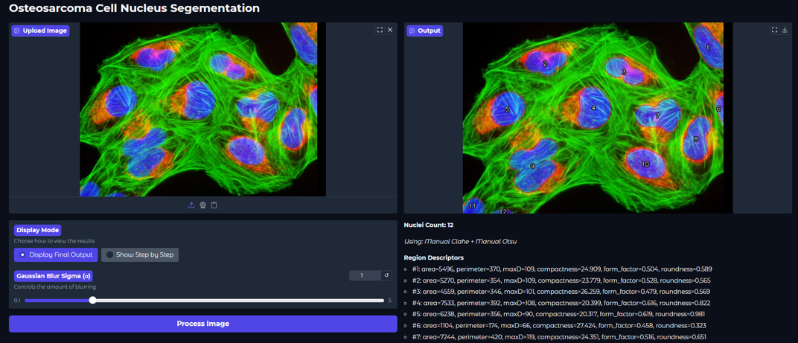
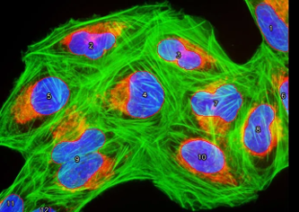

# Osteosarcoma Cell Nucleus Segmentation & Counter

A comprehensive Python application for automated detection, segmentation, and counting of cell nuclei in microscopy images, specifically designed for osteosarcoma cell analysis. This project provides both a user-friendly web interface and a complete image processing pipeline with step-by-step visualization capabilities.

## Overview

This tool helps researchers and medical professionals analyze microscopy images by automatically identifying and counting cell nuclei. It implements a sophisticated image processing pipeline that combines contrast enhancement, noise reduction, thresholding, and morphological operations to achieve accurate segmentation results.

Whether you're a researcher studying cell morphology, a medical professional analyzing tissue samples, or a student learning computer vision techniques, this application provides an intuitive way to process and analyze microscopy images.


*The interactive web interface showing the image upload and processing controls*

## Key Features

### Interactive Web Interface
- **Easy Image Upload**: Drag-and-drop or click to upload your microscopy images
- **Real-Time Processing**: See results instantly with automatic processing
- **Step-by-Step Visualization**: Explore each stage of the processing pipeline interactively
- **Adjustable Parameters**: Fine-tune Gaussian blur intensity with a simple slider
- **Multiple Algorithm Options**: Compare different histogram equalization and thresholding methods

### Advanced Image Processing
- **Manual Algorithm Implementations**: Custom implementations of CLAHE, Otsu thresholding, and Gaussian blur for educational purposes
- **Morphological Operations**: Erosion, dilation, opening, and closing for noise removal and boundary refinement
- **Connected Components Analysis**: Automatic nuclei counting with label assignment
- **Region Descriptors**: Calculate area, perimeter, form factor, roundness, and compactness for each detected nucleus

### Two Display Modes
1. **Display Final Output**: Quick view of segmented results with nuclei count
2. **Show Step by Step**: Interactive exploration of all 10 processing stages

## Quick Start

### Prerequisites

- Python 3.7 or higher
- pip (Python package manager)

### Installation

1. **Clone or download this repository**

2. **Install required packages**:
   ```bash
   pip install -r requirements.txt
   ```

   This will install:
   - `opencv-python` (≥4.8.0) - Image processing operations
   - `numpy` (≥1.24.0) - Numerical computations
   - `gradio` (≥4.0.0) - Web interface framework

### Running the Application

1. **Launch the web interface**:
   ```bash
   python nuclei_ui.py
   ```

2. **Open your web browser** and navigate to the URL shown in the terminal (typically `http://127.0.0.1:7860`)

3. **Upload an image** using the upload button or drag-and-drop interface

4. **Choose your display mode**:
   - Select "Display Final Output" for quick results
   - Select "Show Step by Step" to explore the processing pipeline

5. **Adjust parameters** (optional):
   - Use the Gaussian Blur Sigma slider to control noise reduction (default: 1.0)
   - Try different histogram equalization methods at Step 2
   - Compare thresholding algorithms at Step 4

6. **Click "Process Image"** to analyze your image

## Processing Pipeline

The application processes images through a carefully designed 10-step pipeline:


1. **Original Image Extraction**: Extracts the blue channel from the input image
2. **Histogram Equalization**: Enhances contrast using one of three methods:
   - Manual Histogram Equalization
   - Manual CLAHE (Contrast Limited Adaptive Histogram Equalization)
   - OpenCV Built-in CLAHE
3. **Gaussian Blur**: Reduces noise with adjustable sigma parameter (0.1-5.0)
4. **Otsu Thresholding**: Automatically determines optimal threshold for binary segmentation
   - Manual Otsu implementation
   - OpenCV built-in Otsu
5. **Erosion**: Removes small artifacts (3 iterations)
6. **Opening**: Smooths object boundaries (dilation after erosion)
7. **Dilation**: Expands objects to fill gaps (3 iterations)
8. **Closing**: Fills small holes (erosion after dilation)
9. **Boundary Detection**: Extracts precise cell boundaries
10. **Final Output**: Overlays red boundaries and numbered labels on the original image, counts nuclei




## Technical Details

### Algorithm Implementations

This project includes manual implementations of several key algorithms:

- **Histogram Equalization**: Custom implementation using cumulative distribution function (CDF) mapping
- **CLAHE**: Manual implementation of Contrast Limited Adaptive Histogram Equalization with tile-based processing
- **Gaussian Blur**: Custom convolution implementation with configurable kernel size and sigma
- **Otsu Thresholding**: Manual implementation of Otsu's method for optimal threshold selection
- **Connected Components**: Custom labeling algorithm using depth-first search for nuclei counting

### Region Descriptors

For each detected nucleus, the application calculates:
- **Area**: Number of pixels in the region
- **Perimeter**: Length of the boundary
- **Form Factor**: Measure of circularity (4π × area / perimeter²)
- **Roundness**: Measure of how round the shape is (4 × area / π × max_diameter²)
- **Compactness**: Measure of shape complexity (perimeter² / area)

## Project Structure

```
project/
├── nuclei_ui.py              # Main web application (Gradio interface)
├── a.py                      # Experimental script with watershed segmentation
├── b.py                      # Experimental script with noise filtering
├── c.py                      # Experimental script with full pipeline
├── d.py                      # Experimental script with boundary detection
├── requirements.txt         # Python dependencies
├── README.md                 # This file
├── README_UI.md              # UI-specific documentation
├── INTERACTIVE_FEATURES.md   # Interactive features guide
├── 6.jpg, 7.png, 9.png, 10.png  # Sample microscopy images
└── de.txt                    # Additional notes/documentation
```

## Educational Value

This project serves as an excellent learning resource for:
- **Computer Vision**: Understanding image processing pipelines
- **Medical Image Analysis**: Practical application in biomedical research
- **Algorithm Implementation**: Manual implementations of standard CV algorithms
- **Interactive Visualization**: Building user-friendly interfaces for complex processes

## Usage Tips

1. **Image Quality**: For best results, use high-contrast microscopy images with clearly visible cell nuclei
2. **Parameter Tuning**: Adjust the Gaussian blur sigma based on image noise levels:
   - Lower values (0.1-1.0) for cleaner images
   - Higher values (2.0-5.0) for noisier images
3. **Method Comparison**: Use step-by-step mode to compare different equalization and thresholding methods
4. **Batch Processing**: The core functions can be adapted for batch processing multiple images

## Advanced Usage

### Using the Processing Functions Directly

You can import and use the processing functions in your own Python scripts:

```python
from nuclei_ui import process_nuclei_image
import cv2

# Load an image
image = cv2.imread('your_image.jpg')
image_rgb = cv2.cvtColor(image, cv2.COLOR_BGR2RGB)

# Process the image
results = process_nuclei_image(
    input_image=image_rgb,
    sigma=1.0,
    equalization_method='manual_clahe',
    threshold_method='manual_otsu'
)

# Access results
nuclei_count = results['count']
final_image = results['final']
descriptors = results['descriptors']

print(f"Detected {nuclei_count} nuclei")
```

## Troubleshooting

**Issue**: Application won't start
- **Solution**: Ensure all dependencies are installed: `pip install -r requirements.txt`

**Issue**: Images not processing correctly
- **Solution**: Verify your image is in a supported format (JPG, PNG) and has sufficient contrast

**Issue**: Low nuclei detection accuracy
- **Solution**: Try adjusting the Gaussian blur sigma parameter or experiment with different equalization methods

## Notes

- The application processes images using the blue channel, which is typically most informative for microscopy images
- Processing time depends on image size and complexity
- The step-by-step mode allows you to see intermediate results at each stage
- All morphological operations use a 3×3 structuring element

## Contributing

This project is designed for educational and research purposes. Feel free to:
- Experiment with different parameters
- Modify the processing pipeline
- Add new features or algorithms
- Share your results and improvements

## License

This project is provided as-is for educational and research purposes.

## Acknowledgments

This project demonstrates practical applications of computer vision techniques in medical image analysis, specifically for osteosarcoma cell nucleus segmentation. The manual implementations of standard algorithms serve both educational and research purposes.

---

**Happy Analyzing!**

If you find this tool useful for your research or learning, we'd love to hear about your experience!
